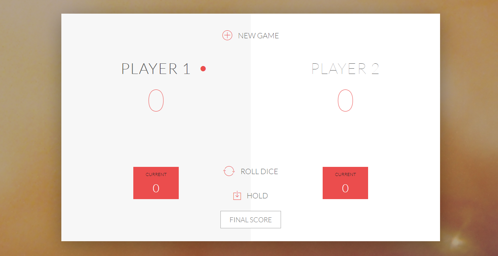

<!-- PROJECT LOGO -->

<!-- PROJECT NAME -->
# Pig Game
Pig Game is a game browser. Its main goal is to learn DOM manipulation in JavaScript.

<!-- TABLE OF CONTENTS -->
## Table of Contents
* [About the Project](#about-the-project)
* [Getting Started](#getting-started)
	* [Prerequisites](#prerequisites)
	* [Installing](#installing)
* [Usage](#usage)
* [Built With](#built-with)
* [Authors](#authors)
* [License](#license)
* [Contact](#contact)
* [Acknowlegments](#acknowledgements)

## About the Project

Pig Game is a game browser developed by Jonas Schmedtmann in the Udemy course [The Complete JavaScript Course 2020](https://www.udemy.com/course/the-complete-javascript-course/). I wrote this code to learn basic techniques to know how to manipulate the DOM. Besides, this code will help to develop other web games or Web App's as a code reference.

The focusing part of this project is the use of JavaScript's **DOM** manipulation..

**Notes**
>The code is full of Spanish comments.

<!-- GETTING STARTED -->
## Getting Started
To setting up the project locally you can download a copy of this project clicking on the *Clone or download* and then *Download ZIP*, or you can follow these simple example steps to get a copy of Pig Game on your repository.

### Prerequisites
There is no prerequisites to run this game, just a web browser!

### Installing
No need to install!

<!-- USAGE -->
## Usage
Feel free to use this code (see more on [license](#license)).
* Watch and interact with the different elements along the Web App.
* With your web browser, you can inspect all the elements to know how was built.
* You can play with friends as long as you want!

## Built with
This project is plugin free. You don't need nothing to run it!

<!-- CONTRIBUTING -->
## Contributing
Contributions are what make the open source community such an amazing place to learn, inspire and create. Any contributions you make are **greatly appreciated**.

1. Fork the project.
2. Create your Feature Branch: `git checkout -b feature/example-name`.
3. Commit your changes: `git commit -m 'Add some features'`.
4. Push to the Branch: `git push origin feature/example-name`.
5. Open a Pull Request.

<!-- AUTHORS -->
## Authors
* **Guillem Martí**: built and documentation

<!-- LICENCE -->
## License
The license of this project is from [Jonas Schmedtmann](http://codingheroes.io). The code of this project is open source to learn but not for commercial purposes.

<!-- CONTACT -->
## Contact
Guillem Martí - [@guimarbe](https://twitter.com/guimarbe)

<!-- ACKNOWLEDGEMENTS -->
## Acknowledgements
* [atom](https://atom.io/)
* [Emmet](https://emmet.io/)
* [Unsplash](https://unsplash.com/)
* [Ionicons](https://www.ionicons.com/)
